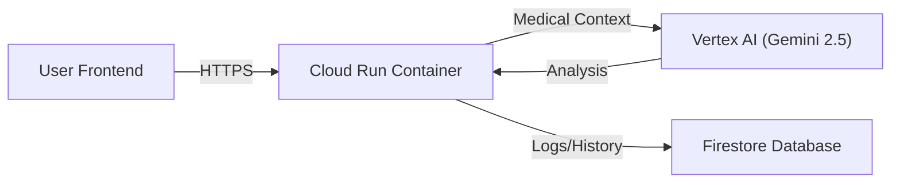

# MedSafe AI: Personal Pharmacovigilance Assistant

**BNB Marathon 2025 Submission**

MedSafe AI is a serverless application that empowers patients to check for dangerous interactions between their medications, medical conditions, and lifestyle choices (diet, smoking, alcohol).

## 🚀 Live Demo
*   **Deployed App:** [https://medsafe-ai-894821678026.europe-west1.run.app/](https://medsafe-ai-894821678026.europe-west1.run.app/)
*   **Demo Video:** [INSERT_YOUR_VIDEO_LINK_HERE]

## 🏗️ Architecture

The application follows a serverless, event-driven architecture hosted on Google Cloud Platform.

### Components
1.  **Frontend/Backend:** Python Streamlit application.
2.  **Compute:** Google Cloud Run (Serverless, auto-scaling).
3.  **AI Engine:** Vertex AI (Gemini 2.5 Flash) for medical reasoning and NLU.
4.  **Persistence:** Cloud Firestore (NoSQL) for storing user search history and audit logs.

## 🛠️ Implementation Details

*   **Language:** Python 3.9
*   **Framework:** Streamlit (for rapid UI/UX development)
*   **AI Integration:** Uses `vertexai.generative_models` to interface with Gemini. The model is prompted with specific medical personas and strict formatting rules.
*   **Data Storage:** Stores structured JSON data (User ID, Meds, Conditions, AI Response) in Firestore.

## 🏃‍♂️ How to Run Locally

1.  Clone the repository.
2.  Install dependencies:
    `pip install -r requirements.txt`
3.  Run the app:
    `streamlit run app.py`

## 📄 License
MIT License
